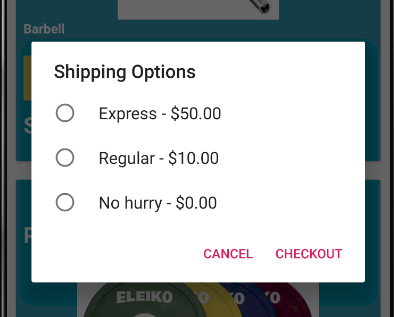

<h1>Madanay Nicer Shop</h1>
<h2>Description</h2>
This is a modified version of the first assignment (MadadnayShop). Instead of using different cardViews for each item, I needed to implement a RecyclerView because it is much more efficient when used with a large amount of data.

I also needed to implement a alert dialog for the shipping options.  

An option menu has been added to improve user experience. 

To use the app, Simply click on the "-" (decrease) or "+" (increase) buttons to remove or add respectively unto your cart. Your subtotal will be

<h2>Image Sources</h2>
images-na.ssl-images-amazon.com
medmaw.com
allbestops.com
liftinglarge.com
i5.walmartimages.ca
cdn.shopify.com
i.ebayimg.com
ep.yimg.com

<h2>Menus to be Implemented</h2>
<h3>Options Menu</h3>
It would contain:
<ul>
    <li><b>Change location:</b> E.g. Change from Canada store to USA store</li>
    <li><b>Sign in</b></li>
    <li><b>Theme:</b> Switch from light to dark mode</li>
    <li><b>Language:</b> Switch to a different language</li>
    <li><b>Account Settings:</b> E.g. Password changes, payment changes</li>
    <li><b>Sign up:</b> Goes to the sign up page</li>
    <li><b>Log out:</b>If user is signed in, this option will be shown/li>
</ul>
This is the perfect type of menu for these options because every option listed 
affects the overall app. For example, if we change the language, we potentially change every String in each activity. In the sign in page, we 
want to see the types of items that the user prefers.

<h3>Popup Menu</h3>
Anchor a popup menu to each product image. In the menu, it would contain:
<ul>
    <li><b>Product Details:</b> Opens up another activity that describes the product in more detail</li>
    <li><b>Check Reviews:</b> Checks reviews for the particular item</li>
    <li><b>Add to wishlist:</b> adds item to a wishlist</li>
</ul>
I'm using popup menus in this sitution to avoid clutter in the cardView. It is also perfect because each image will popups with the same options but they will lead to different activities (e.g. Reviews of that particular product).

<h2>License</h2>
MIT License
Copyright (c) 2919 Darrell-David Madanay

Permission is hereby granted, free of charge, to any person obtaining a copy of this software and associated documentation files (the "Software"), to deal in the Software without restriction, including without limitation the rights to use, copy, modify, merge, publish, distribute, sublicense, and/or sell copies of the Software, and to permit persons to whom the Software is furnished to do so, subject to the following conditions:

The above copyright notice and this permission notice shall be included in all copies or substantial portions of the Software.

THE SOFTWARE IS PROVIDED "AS IS", WITHOUT WARRANTY OF ANY KIND, EXPRESS OR IMPLIED, INCLUDING BUT NOT LIMITED TO THE WARRANTIES OF MERCHANTABILITY, FITNESS FOR A PARTICULAR PURPOSE AND NONINFRINGEMENT. IN NO EVENT SHALL THE AUTHORS OR COPYRIGHT HOLDERS BE LIABLE FOR ANY CLAIM, DAMAGES OR OTHER LIABILITY, WHETHER IN AN ACTION OF CONTRACT, TORT OR OTHERWISE, ARISING FROM, OUT OF OR IN CONNECTION WITH THE SOFTWARE OR THE USE OR OTHER DEALINGS IN THE SOFTWARE.