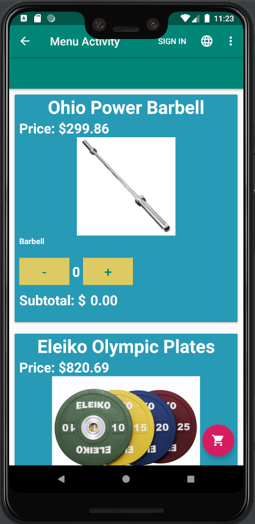

<h2>Menus to be Implemented</h2>
<h3>Options Menu</h3>
It would contain:
<ul>
    <li><b>Change location:<b> E.g. Change from Canada store to USA store</li>
    <li><b>Sign in<b></li>
    <li><b>Theme:</b> Switch from light to dark mode</li>
    <li><b>Language:</b> Switch to a different language</li>
    <li><b>Account Settings:</b> E.g. Password changes, payment changes</li>
    <li><b>Sign up:</b> Goes to the sign up page</li>
    <li><b>Log out:</b>If user is signed in, this option will be shown/li>
</ul>
This is the perfect type of menu for these options because every option listed 
affects the overall app. For example, if we change the language, we potentially change every String in each activity. In the sign in page, we 
want to see the types of items that the user prefers.

<h3>Popup Menu</h3>
Anchor a popup menu to each product image. In the menu, it would contain:
<ul>
    <li><b>Product Details:</b> Opens up another activity that describes the product in more detail</li>
    <li><b>Check Reviews:</b> Checks reviews for the particular item</li>
    <li><b>Add to wishlist:</b> adds item to a wishlist</li>
</ul>
I'm using popup menus in this sitution to avoid clutter in the cardView. It is also perfect because each image will popups with the same options but they will lead to different activities (e.g. Reviews of that particular product).

https://images-na.ssl-images-amazon.com
medmaw.com
allbestops.com
liftinglarge.com
i5.walmartimages.ca
cdn.shopify.com
i.ebayimg.com
ep.yimg.com